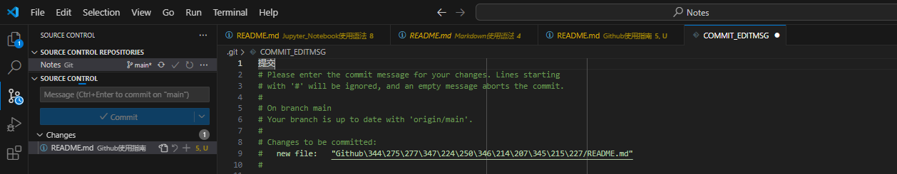
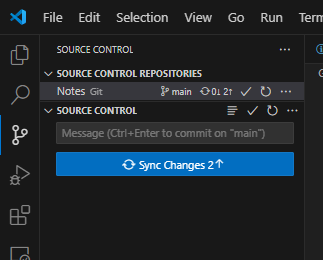
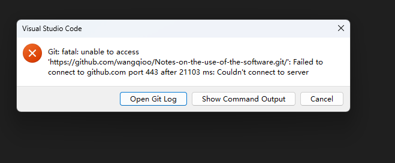
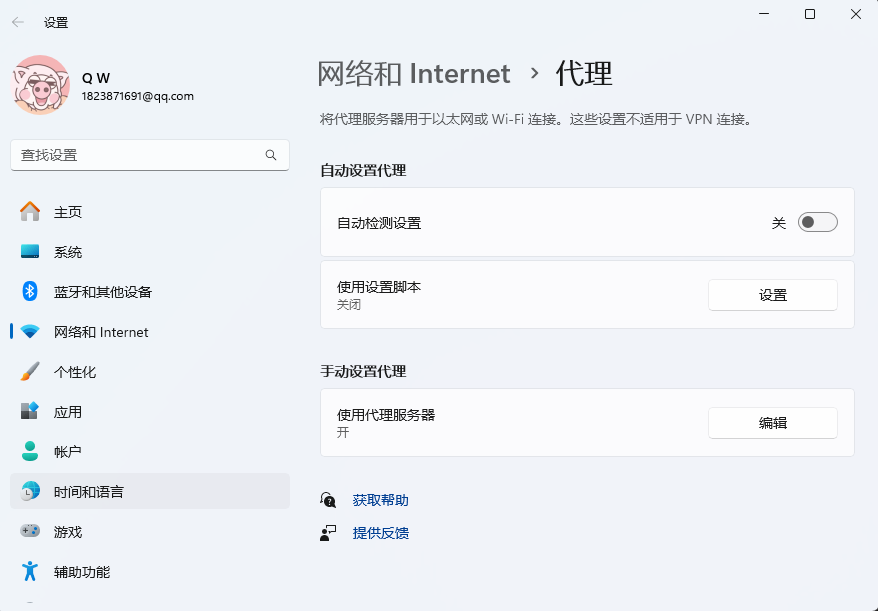
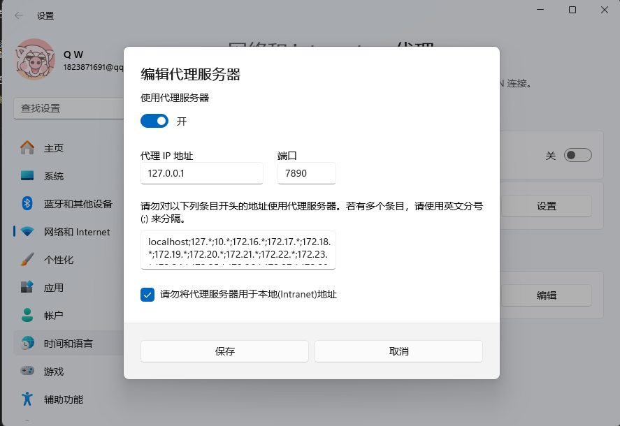
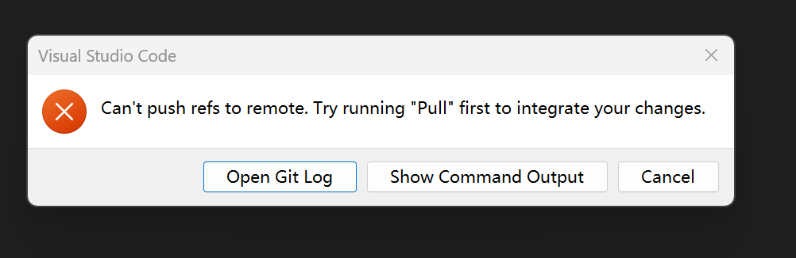
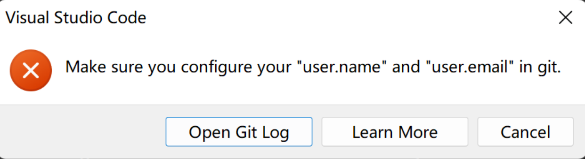

# 使用Github与本地仓库工作流程
1. 在github创建仓库，并复制HTTPS地址
2. 打开Vscode或PyCharm链接到github仓库
3. 创建并编写完成本地文档后上传至Github仓库

## Vscode链接Github仓库及上传注意事项
- 点击source control，点击Commit
- 此时要注意填写提交说明，并大点击√确认

- 再点击sync changes并上传所有修改记录至github

## 注意失败现象
1. 点击Commit后未注意到要填写提交说明，导致一直转圈等待提交
2. 由于使用Vpn导致网络端口发生改变，使用不了git。
解决方法是：首先在系统中搜索“代理”，打开如下设置界面，其次编辑代理服务器

查看此时电脑的上网端口，并记住自己的端口号

最后打开git bash，并修改端口号
git config --global http.proxy 127.0.0.1:当前端口号

git config --global https.proxy 127.0.0.1:当前端口号

此方法参考以下网页
[Git 失败，修改端口号](https://blog.csdn.net/qq_40296909/article/details/134285451)

3. 代码冲突问题，在本地修改代码的期间，别人先行提交了代码，或着我在github网页端修改了代码，导致本地不是最新的仓库，代码冲突。

[参考文章链接](https://huaweicloud.csdn.net/63a570e1b878a545459474b0.html?spm=1001.2101.3001.6661.1&utm_medium=distribute.pc_relevant_t0.none-task-blog-2%7Edefault%7ECTRLIST%7Eactivity-1-109855178-blog-97565768.235%5Ev38%5Epc_relevant_anti_t3&depth_1-utm_source=distribute.pc_relevant_t0.none-task-blog-2%7Edefault%7ECTRLIST%7Eactivity-1-109855178-blog-97565768.235%5Ev38%5Epc_relevant_anti_t3&utm_relevant_index=1)

4. 出现要配置邮箱和姓名的问题

// 配置邮箱

git config --global user.email "1823871691@qq.com"
 
// 配置用户名

git config --global user.name "wangqioo"

[参考文章链接](https://blog.csdn.net/qq_41271930/article/details/117514127)

5. 想要删除从github下载的仓库，发现正在运行，删除不了

解决措施：
- 在vscode里关闭此文件夹
- 再去电脑里此文件夹所在位置手动删除

