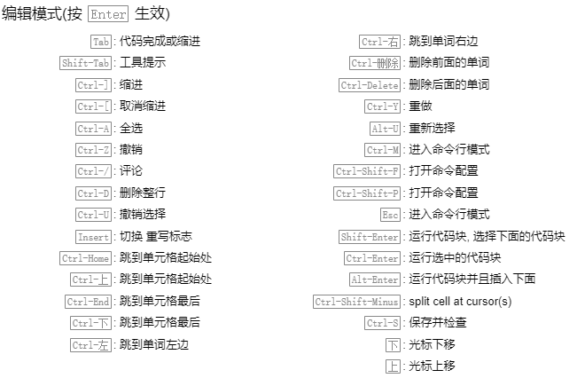

# Jupyter Notebook使用说明

## 优势介绍
图文代码混编，全在一个文档里，边写边看边执行，可以执行段落代码。可以直接浏览器运行，直接运行Github上的开源程序，运行结果一键保存，便于分享。

## 命令行打开jupyter notebook
1.打开Anaconda软件列表中的Anaconda Prompt

2.创建一个虚拟环境或进入原有的虚拟环境中

3.输入jupyter notebook打开

## Markdown语法
表示1-6级标题: #-######

加粗使用** ：** 文本 **

插入超链接：[链接名称]（链接地址）

插入图片：直接拖入图片到输入格

## 支持LaTex公式
数学公式只能在Markdown格式的格内输入

行内公式：$ 开始，一个dollar结束

居中公式：$$开始，两个dollar结束

## 常用快捷键
运行当前单元格，并停留在本单元格：Ctrl + Enter

运行当前单元格，并选择下一个单元格：Shift + Enter

运行当前单元格，并在下面插入新单元格：Alt + Enter

序号：直接在文本前面加序号1. 文本，注意加空格

mark点：在文本前加- 文本，注意加空格

在上面插入单元格：A

在下面插入单元格：B

切换成Markdown属性：M

切换成代码属性：Y

删除单元格：DD

在网页端调出快捷键帮助：H

撤回上一步操作：Ctrl + Z ，Ctrl + Z 

