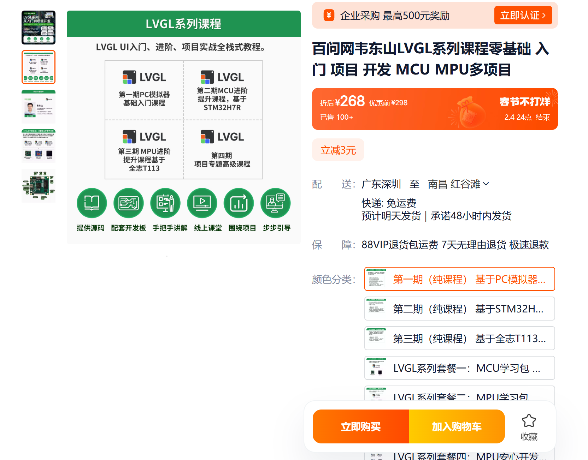

# 韦东山LVGL教程
[韦东山LVGL(V8)视频](https://www.bilibili.com/video/BV1Ya411r7K2/?share_source=copy_web&vd_source=c7eacf65356bd9b3ebb5403b8ff1d512)

[韦东山LVGL(V9)视频](https://www.bilibili.com/video/BV1or421L75s/?share_source=copy_web&vd_source=c7eacf65356bd9b3ebb5403b8ff1d512)

注意：v9要花钱，且是在STM32H7上开发的，要有高性能芯片支持，估我还是学V8
