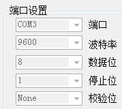
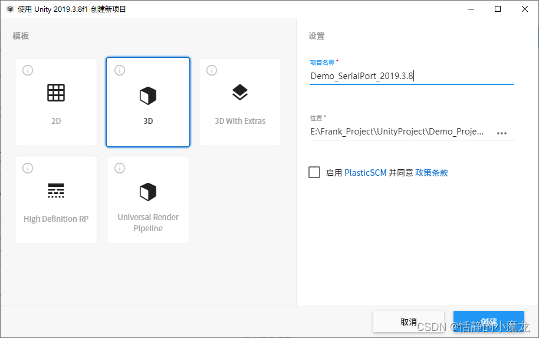
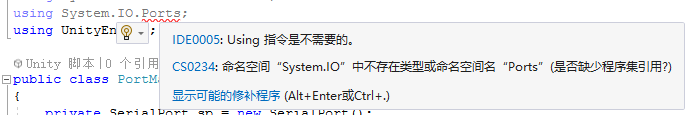
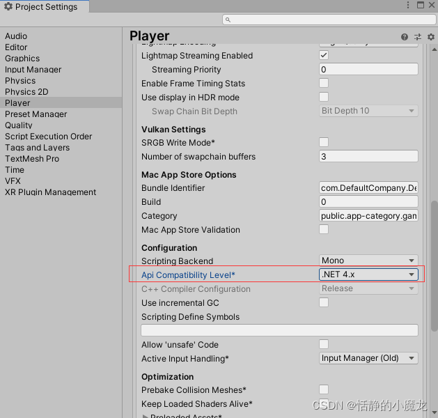

# Unity3D与串口通信 SerialPort类完全教程

[参考网页地址](https://blog.csdn.net/q764424567/article/details/123177585?ops_request_misc=&request_id=&biz_id=102&utm_term=unity3d%20%E4%B8%B2%E5%8F%A3%E9%80%9A%E4%BF%A1&utm_medium=distribute.pc_search_result.none-task-blog-2~all~sobaiduweb~default-2-123177585.142^v86^insert_down38v5,239^v2^insert_chatgpt&spm=1018.2226.3001.4187)

## 思路整理
要想完美的完成一件事件，首先需要在脑子里将思路进行整理，确定自己的思路。

先说串口通信。

串口通信，首先要扫描那些端口是可用的，只有端口可用才能正常的发送指令。

扫描完端口，获得可用的端口列表.

打开串口需要端口号、波特率、数据位、停止位、校验位，如下图所示：



打开完串口，之后就是向串口发送信息，发送信息就是串口的API就可以了。

发送信息，肯定就有接收信息，接收信息可以使用线程不停的接收信息，也可以使用回调委托接收。

最后，断开串口。

总结一下就是：

- 扫描端口（试错端口、注册表查看、API查看）
- 连接串口（端口号、波特率、数据位、停止位、校验位）
- 发送信息（API）
- 接收信息（线程、委托）
- 断开串口（API）

## 代码实现
新建项目，使用版本Unity 2019.3.8f1，模板就用3D就好啦，命名为Demo_SerialProt_2019.3.8：


首先，引入命名空间using System.IO.Ports;，如果显示命名空间“System.IO”中不存在类型或命名空间名"Ports"，缺少程序集引用错误：





编译完成就可以了。

1. 扫描端口

第一种：使用SerialPort类自带的GetPortNames的方法获取端口。
```c
    //使用API扫描
    private string[] ScanPorts_API()
    {
        string[] portList = SerialPort.GetPortNames();
        return portList;
    }
```
第二种：获取注册表中的端口信息的方法获取端口。
```c
//使用注册表信息扫描
    private string[] ScanPorts_Regedit()
    {
        RegistryKey keyCom = Registry.LocalMachine.OpenSubKey("Hardware\\DeviceMap\\SerialComm");
        string[] SubKeys = keyCom.GetValueNames();
        string[] portList = new string[SubKeys.Length];
        for (int i = 0; i < SubKeys.Length; i++)
        {
            portList[i] = (string)keyCom.GetValue(SubKeys[i]);
        }
        return portList;
    }
```
第三种：试错的方法获取有效的端口。
```c
//试错方式扫描
    private string[] ScanPorts_TryFail()
    {
        List<string> tempPost = new List<string>();
        bool mark = false;
        for (int i = 0; i < 10; i++)
        {
            try
            {
                SerialPort sp = new SerialPort("COM" + (i + 1).ToString());
                sp.Open();
                sp.Close();
                tempPost.Add("COM" + (i + 1).ToString());
                mark = true;
            }
            catch (System.Exception)
            {
                continue;
            }
            
        }
        if (mark)
        {
            string[] portList = tempPost.ToArray();
            return portList;
        }
        else
        {
            return null;
        }
    }

```
推荐使用一、二中方法，第三种方法只能说是鬼点子，循环打开COM1-COM10端口：

- 能打开关闭，就存到List中。
- 报错就继续循环。

2. 连接串口/断开串口
打开串口：
```c
/// <summary>
    /// 打开串口
    /// </summary>
    /// <param name="_portName">端口号</param>
    /// <param name="_baudRate">波特率</param>
    /// <param name="_parity">校验位</param>
    /// <param name="dataBits">数据位</param>
    /// <param name="_stopbits">停止位</param>
    private void OpenSerialPort(string _portName, int _baudRate, Parity _parity, int dataBits, StopBits _stopbits)
    {
        try
        {
            if (!sp.IsOpen)
            {
                sp = new SerialPort(_portName, _baudRate, _parity, dataBits, _stopbits);//绑定端口
                sp.Open();
            }
        }
        catch (Exception e)
        {
            sp = new SerialPort();
            Debug.Log(e);
        } 
    }
```
对打开串口可能出现的问题进行了规避，比如说打开串口失败，就新建一个串口对象。
串口不在打开的状态，才去打开串口。

关闭串口：
```c
/// <summary>
    /// 关闭串口
    /// </summary>
    private void CloseSerialPort()
    {
        sp.Close();
    }
```
3. 发送数据
发送数据封装了两个函数，一个是发送string类型数据，一个是发送byte[]数据：
```c
    /// <summary>
    /// 发送数据
    /// </summary>
    /// <param name="_info">string数据</param>
    private void SendData(string _info)
    {
        try
        {
            if (sp.IsOpen)
            {
                sp.WriteLine(_info);
            }
            else
            {
                sp.Open();
                sp.WriteLine(_info);
            }
        }
        catch (Exception ex)
        {
            Debug.Log(ex);
        }
    }
    /// <summary>
    /// 发送数据
    /// </summary>
    /// <param name="send">byte数据</param>
    /// <param name="offSet">起始位</param>
    /// <param name="count">byte长度</param>
    private void SendData(byte[] send, int offSet, int count)
    {
        try
        {
            if (sp.IsOpen)
            {
                sp.Write(send, offSet, count);
            }
            else
            {
                sp.Open();
                sp.Write(send, offSet, count);
            }
        }
        catch (Exception ex)
        {
            Debug.Log(ex);
        }
    }
```
4. 接收数据
接收数据有两种方式，一种是使用委托，一种是使用线程，下面分开讲解。

委托绑定回调函数，进行数据接收：
```c
/// <summary>
    /// 打开串口
    /// </summary>
    /// <param name="_portName">端口号</param>
    /// <param name="_baudRate">波特率</param>
    /// <param name="_parity">校验位</param>
    /// <param name="dataBits">数据位</param>
    /// <param name="_stopbits">停止位</param>
    private void OpenSerialPort(string _portName, int _baudRate, Parity _parity, int dataBits, StopBits _stopbits)
    {
        try
        {
            if (!sp.IsOpen)
            {
                sp = new SerialPort(_portName, _baudRate, _parity, dataBits, _stopbits);//绑定端口
                sp.Open();
                //使用委托
                sp.DataReceived += DataReceived;
            }
        }
        catch (Exception ex)
        {
            sp = new SerialPort();
            Debug.Log(ex);
        }
    }
    /// <summary>
    /// 接收数据 回调函数
    /// </summary>
    /// <param name="sender"></param>
    /// <param name="e"></param>
    private void DataReceived(object sender, SerialDataReceivedEventArgs e)
    {
        byte[] ReDatas = new byte[sp.BytesToRead];
        sp.Read(ReDatas, 0, ReDatas.Length);//读取数据
        DataProcessing(ReDatas);//数据处理
    }
    /// <summary>
    /// 数据处理
    /// </summary>
    /// <param name="data">字节数组</param>
    public void DataProcessing(byte[] data)
    {
        StringBuilder sb = new StringBuilder();
        for (int i = 0; i < data.Length; i++)
        {
            sb.AppendFormat("{0:x2}" + "", data[i]);
        }
        Debug.Log(sb.ToString());
    }
```
使用线程：
```c
/// <summary>
    /// 打开串口
    /// </summary>
    /// <param name="_portName">端口号</param>
    /// <param name="_baudRate">波特率</param>
    /// <param name="_parity">校验位</param>
    /// <param name="dataBits">数据位</param>
    /// <param name="_stopbits">停止位</param>
    private void OpenSerialPort(string _portName, int _baudRate, Parity _parity, int dataBits, StopBits _stopbits)
    {
        try
        {
            if (!sp.IsOpen)
            {
                sp = new SerialPort(_portName, _baudRate, _parity, dataBits, _stopbits);//绑定端口
                sp.Open();
                //使用线程
                Thread thread = new Thread(new ThreadStart(DataReceived));
                thread.Start();
            }
        }
        catch (Exception ex)
        {
            sp = new SerialPort();
            Debug.Log(ex);
        }
    }
    /// <summary>
    /// 接收数据 线程
    /// </summary>
    private void DataReceived()
    {
        while (true)
        {
            if (sp.IsOpen)
            {
                int count = sp.BytesToRead;
                if (count > 0)
                {
                    byte[] readBuffer = new byte[count];
                    try
                    {
                        sp.Read(readBuffer, 0, count);
                        DataProcessing(readBuffer);//数据处理
                    }
                    catch (Exception ex)
                    {
                        Debug.Log(ex.Message);
                    }
                }
            }
            Thread.Sleep(10);
        }
    }
```
推荐使用线程，因为Unity3D不支持SerialDataReceivedEventHandler，收数据的回调不会触发。

整体代码如下所示：
```c
using Microsoft.Win32;
using System;
using System.Collections;
using System.Collections.Generic;
using System.IO.Ports;
using System.Text;
using System.Threading;
using UnityEngine;

public class PortManager
{
    private SerialPort sp;
    #region 扫描端口
    //使用API扫描
    public string[] ScanPorts_API()
    {
        string[] portList = SerialPort.GetPortNames();
        return portList;
    }
    //使用注册表信息扫描
    public string[] ScanPorts_Regedit()
    {
        RegistryKey keyCom = Registry.LocalMachine.OpenSubKey("Hardware\\DeviceMap\\SerialComm");
        string[] SubKeys = keyCom.GetValueNames();
        string[] portList = new string[SubKeys.Length];
        for (int i = 0; i < SubKeys.Length; i++)
        {
            portList[i] = (string)keyCom.GetValue(SubKeys[i]);
        }
        return portList;
    }
    //试错方式扫描
    public string[] ScanPorts_TryFail()
    {
        List<string> tempPost = new List<string>();
        bool mark = false;
        for (int i = 0; i < 10; i++)
        {
            try
            {
                SerialPort sp = new SerialPort("COM" + (i + 1).ToString());
                sp.Open();
                sp.Close();
                tempPost.Add("COM" + (i + 1).ToString());
                mark = true;
            }
            catch (System.Exception)
            {
                continue;
            }

        }
        if (mark)
        {
            string[] portList = tempPost.ToArray();
            return portList;
        }
        else
        {
            return null;
        }
    }
    #endregion

    #region 打开串口/关闭串口
    /// <summary>
    /// 打开串口
    /// </summary>
    /// <param name="_portName">端口号</param>
    /// <param name="_baudRate">波特率</param>
    /// <param name="_parity">校验位</param>
    /// <param name="dataBits">数据位</param>
    /// <param name="_stopbits">停止位</param>
    public void OpenSerialPort(string _portName, int _baudRate, Parity _parity, int dataBits, StopBits _stopbits)
    {
        try
        {
            sp = new SerialPort(_portName, _baudRate, _parity, dataBits, _stopbits);//绑定端口
            sp.Open();
            //使用委托
            //sp.DataReceived += DataReceived;
            //使用线程
            Thread thread = new Thread(new ThreadStart(DataReceived));
            thread.Start();
        }
        catch (Exception ex)
        {
            sp = new SerialPort();
            Debug.Log(ex);
        }
    }

    /// <summary>
    /// 关闭串口
    /// </summary>
    public void CloseSerialPort()
    {
        sp.Close();
    }
    #endregion

    #region 发送数据
    /// <summary>
    /// 发送数据
    /// </summary>
    /// <param name="_info">string数据</param>
    public void SendData(string _info)
    {
        try
        {
            if (sp.IsOpen)
            {
                sp.WriteLine(_info);
            }
            else
            {
                sp.Open();
                sp.WriteLine(_info);
            }
        }
        catch (Exception ex)
        {
            Debug.Log(ex);
        }
    }
    /// <summary>
    /// 发送数据
    /// </summary>
    /// <param name="send">byte数据</param>
    /// <param name="offSet">起始位</param>
    /// <param name="count">byte长度</param>
    public void SendData(byte[] send, int offSet, int count)
    {
        try
        {
            if (sp.IsOpen)
            {
                sp.Write(send, offSet, count);
            }
            else
            {
                sp.Open();
                sp.Write(send, offSet, count);
            }
        }
        catch (Exception ex)
        {
            Debug.Log(ex);
        }
    }
    #endregion

    #region 接收数据
    /// <summary>
    /// 接收数据 回调函数
    /// </summary>
    /// <param name="sender"></param>
    /// <param name="e"></param>
    public void DataReceived(object sender, SerialDataReceivedEventArgs e)
    {
        byte[] ReDatas = new byte[sp.BytesToRead];
        sp.Read(ReDatas, 0, ReDatas.Length);//读取数据
        DataProcessing(ReDatas);//数据处理
    }
    /// <summary>
    /// 接收数据 线程
    /// </summary>
    public void DataReceived()
    {
        while (true)
        {
            if (sp.IsOpen)
            {
                int count = sp.BytesToRead;
                if (count > 0)
                {
                    byte[] readBuffer = new byte[count];
                    try
                    {
                        sp.Read(readBuffer, 0, count);
                        DataProcessing(readBuffer);//数据处理
                    }
                    catch (Exception ex)
                    {
                        Debug.Log(ex.Message);
                    }
                }
            }
            Thread.Sleep(10);
        }
    }
    /// <summary>
    /// 数据处理
    /// </summary>
    /// <param name="data">字节数组</param>
    public void DataProcessing(byte[] data)
    {
        StringBuilder sb = new StringBuilder();
        for (int i = 0; i < data.Length; i++)
        {
            sb.AppendFormat("{0:x2}" + "", data[i]);
        }
        Debug.Log(sb.ToString());
    }
    #endregion
}
```


