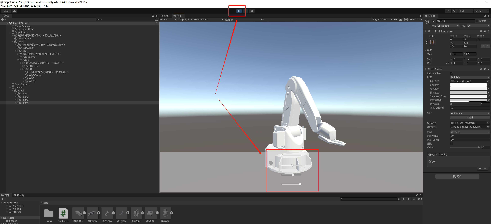

# 小智学长机械臂与Unity通信
[原项目在线wiki文档教程](https://x509p6c8to.feishu.cn/docx/FeMndRrzRommxGxTkFscJ0zKnKh)

[包含文件]

1.机械臂烧录此版本Arduino Vscode工程：mini_arm.zip

2.由Solidworks建模导出的stl格式并转为3ds格式可导入Unity3D的文件：DophinArm.zip

3.SOLIDWORKS 模型导出3ds格式文件软件：spin3d.exe

4.安卓安装包：MiniArm.apk

5.unity3D安装管理器：UnityHubSetup.exe


## Unity端数字孪生实现
0. 接线如下：
- 机械臂烧录此版本Arduino Vscode工程，相比于原工程，主要屏蔽了串口日志打印（文件：mini_arm.zip）
- 机械臂板卡的烧录线接到电脑
- 机械臂板卡的供电线接电源供电
- 关闭VSCode的调试功能，否则会占用COM口，导致Unity3D程序打开COM不成功
- 打开Unity3D工程，运行
- 这时候通过手机APP控制机械臂运动，模型也会跟随运动

1. 用Unity Hub管理安装对应版本的Unity,与文件开发时的版本不同可能会造成兼容性问题
2. SOLIDWORKS 模型导出3ds格式文件
可以先导入到 3dMax 或者 blender 中，然后转成 3ds 或者 fbx 格式导入到 Unity3D 中，但是这两个软件都太大了，下面用超小软件转化。首先我们需要得到机械臂的 3d 打印格式的文件，也就是 stl 格式，这个直接在 SOLIDWORKS 中另存为选 stl 就可以了。

安装Spin3D软件，默认直接安装。安装成功之后我们就直接进入软件了，此时我们需要准备好之前下载的海豚机械臂模型的 stl 文件，解压之后直接全部选中拖入到 Spin 3D 小工具的界面中


拖入之后，我们选择文件类型为 3ds，目录可以自行选择，然后点击 Convert 按钮；


等待一小段时间进度条完成之后我们就可以在目标目录中找到导出的 3ds 文件；


3. 3ds格式文件导入Unity3D
打开 Unity3D 项目，找到 Assets 将 3ds 文件直接拖动到空白区域。选中所有零件直接拖动到上方场景中，就能直接使用机械臂了，它的相对位置也是和 solidworks 中的约束一样。


4. 此处提供（文件：DophinArm.zip）由Solidworks建模导出的stl格式的文件：转为3ds格式可导入Unity3D的文件，并用Unity3D打开


5. 实现Unity模型控制的方法有两种

1.通过监听Canvas的Slider值变化，然后更新机械臂每个轴的位置

这种方式可以用于快速演示，和实体机械臂状态无关，点击工程的运行按钮，然后可以拖拽滑动条进行控制。



2、通过监听串口数据，然后更新机械臂每个轴的位置

这种方式可以用于监听机械臂板卡的数据，当手机APP下发控制指令给机械臂后，机械臂同时把指令通过串口发送给Unity3d的C#程序，程序解析指令后，控制模型运动
蓝牙部分接收APP的控制指令，通过串口发送给Unity3D程序


Unity3D代码如下
注释比较详细了，Start函数是点击启动按钮后会自动执行的函数，Update函数是Start函数执行完后会一直执行的函数，和Arduino的Setup Loop类似。


Start函数中，我们初始化Canvas的几个Slider，然后注册监听，后续就可以监听滑动变化，进行控制。

```c 
        // 记录D对象的初始旋转值
        startRotationD = axisD.transform.rotation;
        sliders[0].GetComponent<Slider>().onValueChanged.AddListener(SliderChange);
        sliders[1].GetComponent<Slider>().onValueChanged.AddListener(SliderChange);
        sliders[2].GetComponent<Slider>().onValueChanged.AddListener(SliderChange);
        sliders[3].GetComponent<Slider>().onValueChanged.AddListener(SliderChange);

        //监听滑动条变化
    public void SliderChange(float value)
    {
        setAngleA = sliders[0].value - angleOffset;
        setAngleB = sliders[1].value - angleOffset;
        setAngleC = sliders[2].value - angleOffset;
        setAngleG = sliders[3].value - angleOffset;
        Debug.Log("APP Set Angle="+setAngleA+" "+setAngleB+" "+setAngleC+" "+setAngleG);
    }
```
然后，打开串口，这里的COM4大家要改为机械臂板卡接到自己电脑的设备管理器中的COM口号，打开后，启动一个线程，一直读取串口的数据，读取到数据后进行解析，解析成功则进行控制。

```c
        /**
        运行模式
        **/
        try
        {
                serialPort = new SerialPort("COM4", 115200, Parity.None, 8, StopBits.One);
                serialPort.Open();
                //使用线程
                Thread thread = new Thread(new ThreadStart(DataReceived));
                thread.Start();
                Debug.Log("COM Init Success");
        }
        catch (Exception ex)
        {
            serialPort = new SerialPort();
            Debug.Log(ex);
        }
        
    //接收串口数据，解析
    private void DataReceived()
    {
        while (true)
        {
            if (serialPort.IsOpen)
            {
                int count = serialPort.BytesToRead;
                if (count > 0)
                {
                    byte[] readBuffer = new byte[count];
                    try
                    {
                        serialPort.Read(readBuffer, 0, count);
                        StringBuilder sb = new StringBuilder();
                        Debug.Log("readBuffer leng = "+readBuffer.Length);

                            //0xA5 0xA5 angle1 angle2 angle3 angle4 angle5
                            if(readBuffer.Length == 8){
                                if(readBuffer[0] == 0xA5 && readBuffer[1] == 0xA5){
                                    if(readBuffer[2] == 0x01){
                                        //实际角度转换模型角度
                                        setAngleA = Convert.ToInt32(readBuffer[3]) - angleOffset;
                                        setAngleB = Convert.ToInt32(readBuffer[4]) - 15;
                                        setAngleC = 180 - Convert.ToInt32(readBuffer[5]);
                                        setAngleG = - Convert.ToInt32(readBuffer[6]);
                                        Debug.Log("Uart Set Angle="+setAngleA+" "+setAngleB+" "+setAngleC+" "+setAngleG);
                                    }
                                }
                            }
                        
                        Debug.Log(sb.ToString());
                    }
                    catch (Exception ex)
                    {
                        Debug.Log(ex.Message);
                    }
                }
            }
            Thread.Sleep(10);
        }
    }    
```
最后在Update函数中，判断几个轴角度的差异，然后实时更新模型的角度。
例如angleA 和setAngleA 的差异，不相等时，让轴的速度不为零，这时候机械臂就会运动，相等时，速度设置为零，这时候停止运动。
```c
void Update()
    {
        /**
        运行模式
        **/
        axisA.transform.RotateAround(centerA.position, Vector3.down, speedA * Time.deltaTime); 
        angleA += speedA * Time.deltaTime;
        if(angleA > setAngleA + 2){
            speedA = -30;
        }else if(angleA < setAngleA - 2){
            speedA = 30;
        }else{
            speedA = 0;
        }

        Vector3 axisBLocal = axisA.transform.rotation * Vector3.up; 
        axisB.transform.RotateAround(centerB.position, axisBLocal, speedB * Time.deltaTime); 
        angleB += speedB * Time.deltaTime;
        if(angleB > setAngleB + 2){
            speedB = -30;
        }else if(angleB < setAngleB - 2){
            speedB = 30;
        }else{
            speedB = 0;
        }

        Vector3 axisCLocal = axisB.transform.rotation * Vector3.up; 
        axisC.transform.RotateAround(centerC.position, axisCLocal, speedC * Time.deltaTime); 
        angleC += speedC * Time.deltaTime; 
        if(angleC > setAngleC + 2){
            speedC = -30;
        }else if(angleC < setAngleC - 2){
            speedC = 30;
        }else{
            speedC = 0;
        }

        Vector3 axisDLocal = axisC.transform.rotation * Vector3.down;
        float deltaAngleBC = (speedB + speedC) * Time.deltaTime; 
        float angleBC = deltaAngleBC; 
        axisD.transform.RotateAround(centerD.position, axisDLocal, angleBC); 

        axisE1.transform.RotateAround(centerE.position, Vector3.down, speedE1 * Time.deltaTime); 
        axisE2.transform.RotateAround(centerE.position, Vector3.down, speedE2 * Time.deltaTime); 
        angleE += speedE2 * Time.deltaTime; 
        if(angleE > setAngleG + 2){
            speedE1 = 30;
            speedE2 = -30;
        }else if(angleE < setAngleG - 2){
            speedE1 = -30;
            speedE2 = 30;
        }else{
            speedE1 = 0;
            speedE2 = 0;
        }

    }
```

