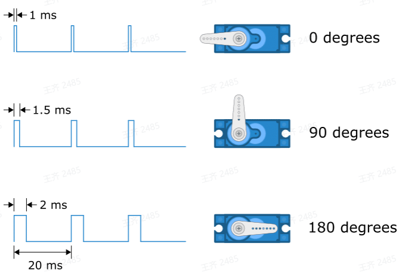
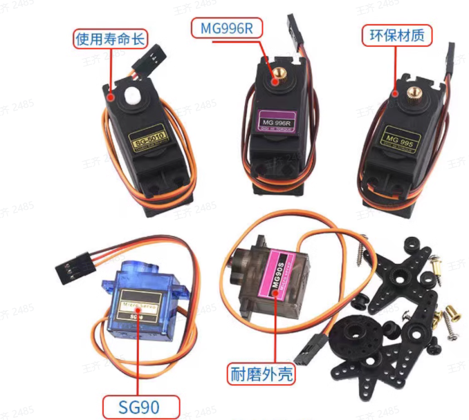

# 舵机类传感器
## SG90/MG996R

0.5ms-------------0度； 2.5% （0.5ms高电平+19.5低电平）
1.0ms------------45度； 5.0% （1.0ms高电平+19.0低电平）
1.5ms------------90度； 7.5% （1.5ms高电平+18.5低电平）
2.0ms-----------135度； 10%  （2.0ms高电平+18.0低电平）
2.5ms-----------180度； 12.5%（2.5ms高电平+17.5低电平）
舵机的控制周期通常为20毫秒、50Hz的频率，但是许多舵机在40至200 Hz的范围内都能正常工作。

[Arduino servo库函数说明（舵机函数库）](./库函数/Arduino_servo库函数.md)

舵机转动指定角度（库实现）