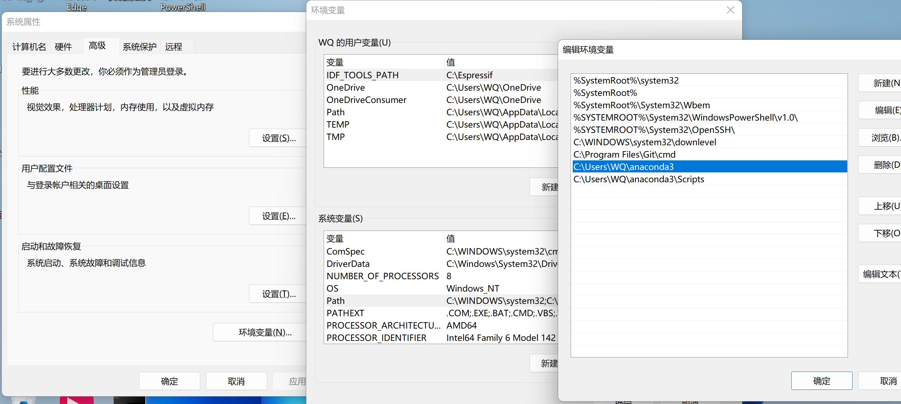
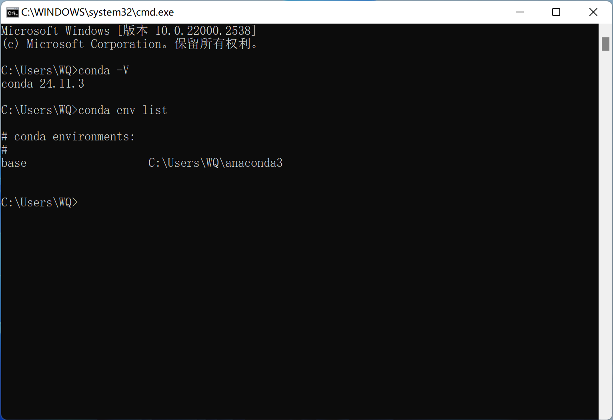
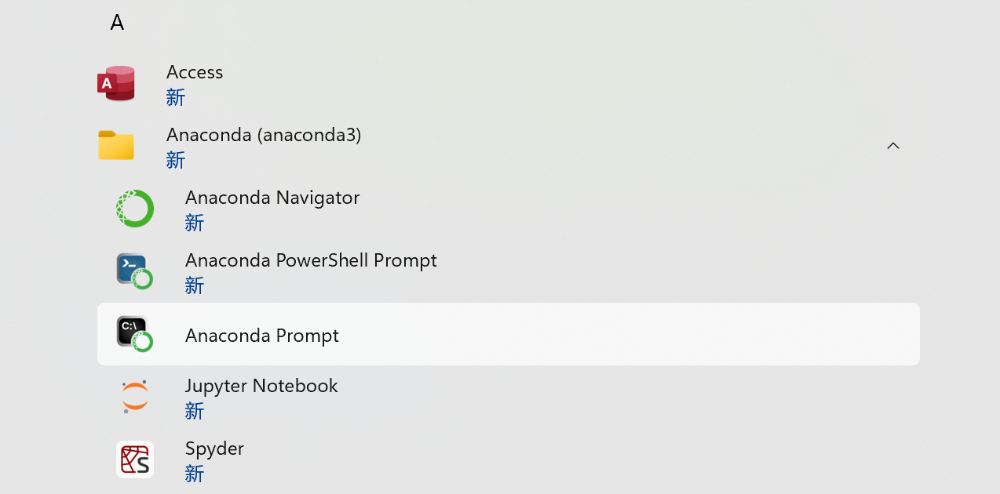

# Cuda
[Cuda+Anaconda安装及使用视频](https://www.bilibili.com/video/BV1oF411s7RS/?share_source=copy_web&vd_source=c7eacf65356bd9b3ebb5403b8ff1d512)

cuda是底层的显卡驱动，是来管理GPU并行运行的统计计算架构（Compute Unified Device Architecture）

- 根据显卡支持的cuda版本，选择对应的版本。
- 查看电脑的显卡型号是否支持CUDA的安装
https://developer.nvidia.com/zh-cn/cuda-gpus
- 查看可以安装的CUDA版本
https://docs.nvidia.com/cuda/cuda-toolkit-release-notes/index.html
- CUDA安装地址
https://developer.nvidia.com/cuda-toolkit-archive


# Anaconda(coda)
Anaconda是Python的包管理器和环境管理器，最大的优势是可以构建多个python开发环境，彼此隔离，互不干扰，需要用到哪个环境可以方便切换

可以自动帮我们安装不同版本的包及其依赖

- Anaconda下载地址
https://www.anaconda.com/products/individual
- 安装好后需要配置环境变量，在Pyth中添加Anaconda的根目录和Scripts目录

- 打开CMD查看版本号：conda -V；查看虚拟环境：conda env list 

- 更换Anaconda的安装包下载源
https://mirrors.tuna.tsinghua.edu.cn/help/anaconda/
1. 修改系统用户目录下的 .condarc 文件来使用镜像站。若无此文件，Windows 用户无法直接创建名为 .condarc 的文件，可先执行 conda config --set show_channel_urls yes 生成该文件之后再修改。
2. 用此段替换.condarc文件中的所有信息，即可添加 Anaconda Python 免费仓库。
```c
channels:
  - defaults
show_channel_urls: true
default_channels:
  - https://mirrors.tuna.tsinghua.edu.cn/anaconda/pkgs/main
  - https://mirrors.tuna.tsinghua.edu.cn/anaconda/pkgs/r
  - https://mirrors.tuna.tsinghua.edu.cn/anaconda/pkgs/msys2
custom_channels:
  conda-forge: https://mirrors.tuna.tsinghua.edu.cn/anaconda/cloud
  pytorch: https://mirrors.tuna.tsinghua.edu.cn/anaconda/cloud
```
3. 添加完成后使用下列命令清除索引缓存，并安装常用包测试一下。
```python
conda clean -i
conda create -n myenv numpy
```
# Anaconda（conda）的常用命令
- 打开Anaconda Prompt

- 查看conda版本信息：conda -V
- 更新包：conda update +  包名
- 安装包：conda install + 包名
- 查找包有那些版本：conda search + 包名
- 删除包：conda remove + 包名
- 查看虚拟环境列表：conda env list  有*表示当前处于该环境下，且默认环境是base环境
- 查看当前环境下已安装的包名：conda list
- 创建新环境：conda creat -n + 环境名 + Python=3.x ;创建好的环境在anaconda3/envs下
- 切换环境：conda activate + 环境名
- 退出当前环境：conda deactivate + 环境名
- 删除某个环境：conda remove -n + 环境名 + --all ; 删除该环境及其所含的所有包

